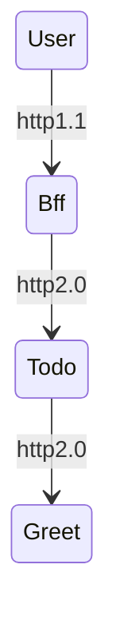

# otel-go-sample

1. curlでbffにrequestする
2. bffからtodoにrequestする
3. todoからgreetにrequestする
4. greetでrequestを受け取り、todoにresponseを返す
5. todoからbffにresponseを返す
6. bffからcurl実行者にresponseを返す

## 実行
1. localhost:8080/todo

## 流れ

## 分散トレース

